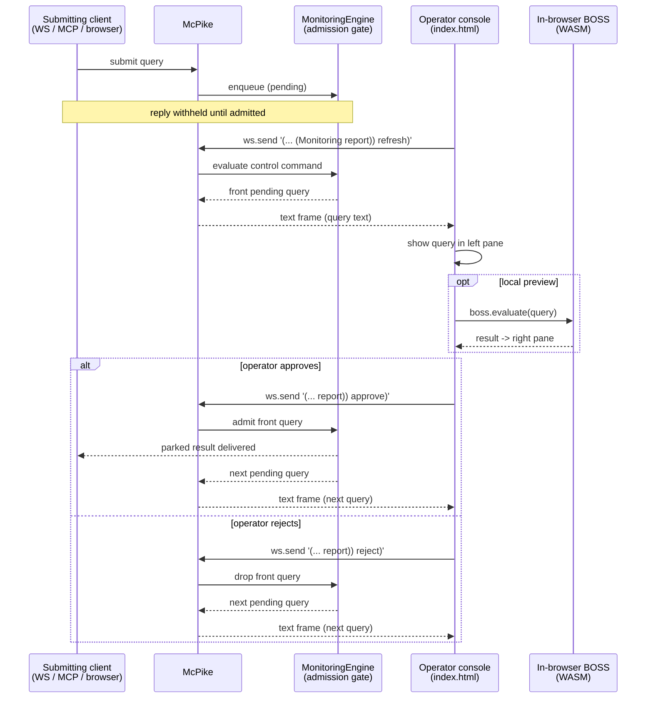

# MonitoringEngine — McPike Operator Console

BOSS is an expression-oriented query engine. **MonitoringEngine** is a BOSS engine that
acts as a human-in-the-loop *admission gate*: every query submitted to the McPike server
is parked in a log and evaluated only once an operator approves it.

This repository provides a single-page **operator console** (`Source/index.html`) and the
in-browser WebAssembly build of BOSS that it embeds. McPike (a separate project) is the
HTTP/WebSocket server that hosts the console and routes evaluation through the gate.

## Components

- **McPike server** — a libmicrohttpd server (the launchd instance listens on port 5080).
  Every evaluation — browser, MCP, or WebSocket — is routed through the monitoring gate.
  Endpoints:
  - `GET /` — the operator console (this repo's `index.html`).
  - `POST /mcp` — one-shot MCP `evaluate` calls.
  - `GET /ws` — persistent WebSocket: one BOSS query per text frame, one result per
    frame, replies in FIFO order. An errored result is prefixed with `;; error:`.
  - `GET /<path>` — a URL path that *encodes* a nested BOSS s-expression (browser path).
- **MonitoringEngine** (`Source/MonitoringEngine.cpp`) — the BOSS engine implementing the
  gate: it holds pending queries and answers the `report` control commands
  (`refresh` / `approve` / `reject`).
- **In-browser WASM BOSS** (`boss.js` + the `.wasm` module) — a full BOSS evaluator
  compiled to WebAssembly, loaded by the console for **local** evaluation (the *Evaluate*
  button), independent of the server-side gate.
- **Operator console** (`Source/index.html`) — a CodeMirror UI. The left pane shows the
  query currently awaiting approval; the right pane shows the result of evaluating it
  locally in WASM. *Refresh* / *Approve* / *Reject* drive the gate.

## The admission gate

Clients submit work three ways (WebSocket, MCP, or browser path). A submission is **not
answered until it is admitted**. Admission is out-of-band: the operator console previews
the front of the pending queue and approves or rejects it. One approve admits exactly one
query, in FIFO order.

The operator's own actions are themselves BOSS queries, evaluated against the
MonitoringEngine:

```lisp
(EvaluateInEngines (List (Monitoring report)) refresh)   ; preview front of queue
(EvaluateInEngines (List (Monitoring report)) approve)   ; admit front, return next
(EvaluateInEngines (List (Monitoring report)) reject)    ; drop front, return next
```

These follow the `(EvaluateInEngines (List <enginePaths>...) <expr>...)` grammar (see
`BOSS.rkt` / `BootstrapEngine.hpp`): the engine pipeline is `(Monitoring report)` — the
report view of the Monitoring engine — and the command is the trailing expression.

## Transport: from URL-encoded HTTP to WebSocket

Originally the console issued each control command as an HTTP `GET` whose **URL path was
the s-expression**, encoded with McPike's path grammar (see `handleBrowserRequest`):
path segments are the symbols, and the run of `/` characters between two segments encodes
a structural move down the expression tree —

- **1 slash** (`/`) — *descend*: open the next symbol as a fresh child sub-expression.
- **2 slashes** (`//`) — *stay*: append the next symbol as a bare atom of the current list.
- **N >= 3 slashes** — *ascend* `N-2` levels, then open the next symbol there.
- a bare `:` segment — switch to *flat mode*: following symbols are bare atoms of the
  current list until an ascending separator or the end of the path.

So `/EvaluateInEngines/List/Monitoring/:/report/////approve` decodes as:

| Segment | Separator before it | Effect | Tree so far |
| --- | --- | --- | --- |
| `EvaluateInEngines` | — | root | `(EvaluateInEngines)` |
| `List` | `/` descend | child of root | `(EvaluateInEngines (List))` |
| `Monitoring` | `/` descend | child of `List` | `(EvaluateInEngines (List (Monitoring)))` |
| `:` | `/` (ignored) | enter flat mode | *(innermost stays `Monitoring`)* |
| `report` | flat | bare atom of `Monitoring` | `... (List (Monitoring report))` |
| `approve` | `/////` ascend to root | child of root | `(EvaluateInEngines (List (Monitoring report)) approve)` |

The console now sends that s-expression **verbatim as a Lisp string over the `/ws`
WebSocket** instead of encoding it in a URL. The reply frame carries the next query
awaiting approval, which is placed in the left pane. Everything else — the local WASM
*Evaluate* path, the button wiring — is unchanged.

Client-side (`index.html`) the socket is opened lazily and shared. Because the server
guarantees one reply per query in send order, a FIFO queue of pending resolvers
correlates each incoming frame with the `loadCode()` call that sent it; `close`/`error`
reject in-flight waiters and force a reconnect on the next action.

## Control flow



## Layout

- `Source/index.html` — the operator console (UI, WASM loader, WebSocket transport).
- `Source/MonitoringEngine.cpp` — the BOSS admission-gate engine.
- `boss.js` + `.wasm` — the in-browser BOSS evaluator, embedded at build time.
